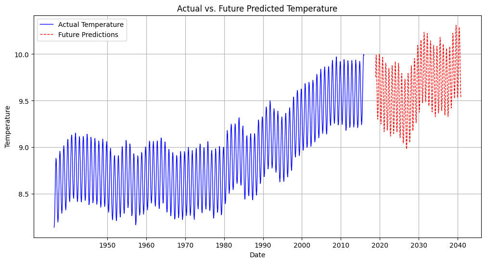
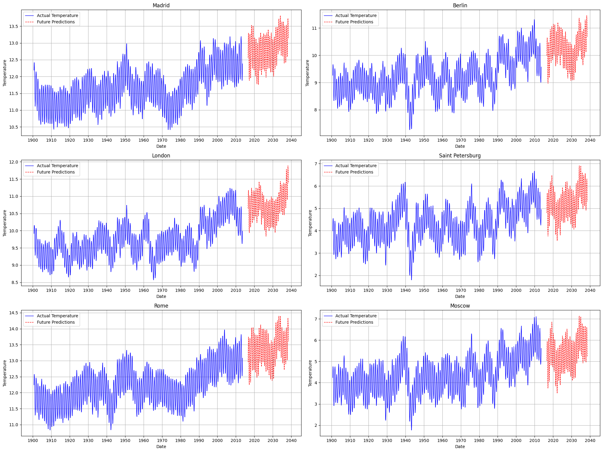
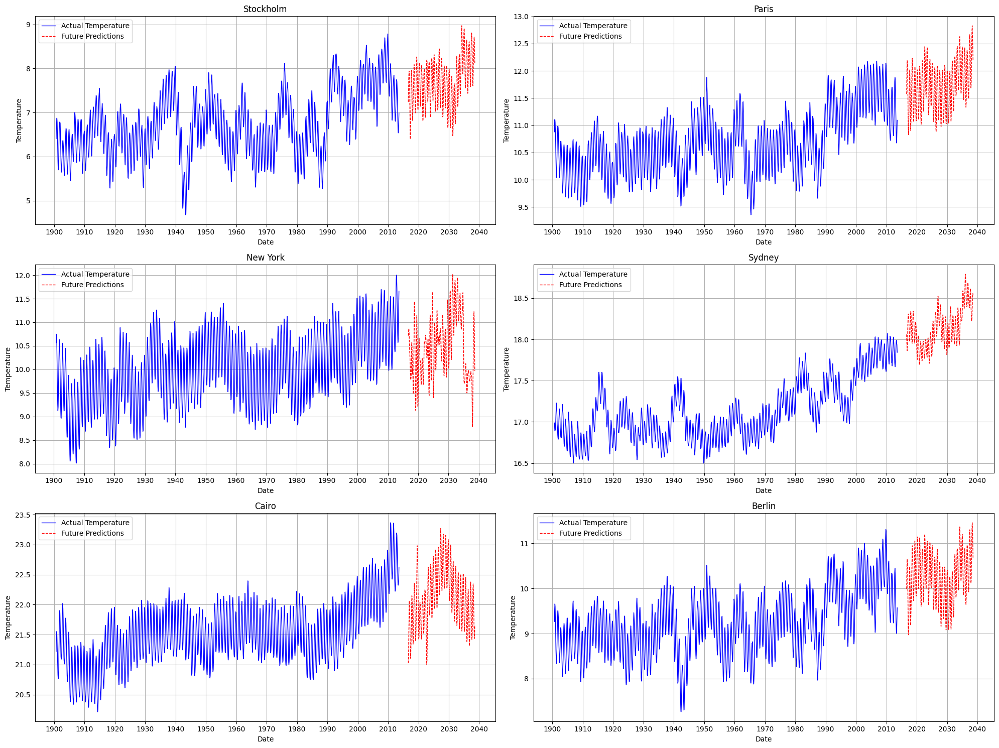

# Advanced Temperature Prediction Using Machine Learning

## Overview
This project leverages historical temperature data to predict future temperature trends using advanced machine learning models. The aim is to address climate change and global warming by providing accurate temperature forecasts that can be used for energy management, agriculture, public health, and other sectors.

## Project Description
The project involves the use of various machine learning techniques, including ARIMA modeling, XGBoost, LightGBM, and LSTM neural networks. The standout performer is the LSTM neural network model, which is particularly effective at capturing local temperature dynamics.

### Key Features
- **Data Collection**: Historical temperature data from cities, countries, and global temperatures.
- **Data Preprocessing**: Handling missing values, converting dates to datetime format, and extracting temporal features.
- **Exploratory Data Analysis (EDA)**: Visualization of temperature trends at different levels using Seaborn and Matplotlib libraries.
- **Machine Learning Models**: Linear Regression, ARIMA, XGBoost, LightGBM, and LSTM neural networks.
- **Model Evaluation**: Using metrics like Mean Squared Error (MSE) and Root Mean Squared Error (RMSE) to quantify prediction accuracy.
- **Future Predictions**: Generating future temperature predictions using the trained models.

## Visualizations
### Global Temperature Predictions


### Major Cities Temperature Predictions


### Specific Cities Temperature Predictions


## How to Use
1. Clone the repository:
   ```sh
   git clone https://github.com/AbdulRehmanRattu/Advanced-Temperature-Prediction-Using-Machine-Learning.git
   cd Advanced-Temperature-Prediction-Using-Machine-Learning
   ```

2. Install the required dependencies:
   ```sh
   pip install -r requirements.txt
   ```

3. Run the Jupyter notebooks to see the analysis and predictions:
   ```sh
   jupyter notebook
   ```

## Results
The results section provides detailed analysis and predictions for temperature trends globally, for major cities, and specific cities. The visualizations help in understanding the temperature variations over time and the potential future trends.

## Contact
If you need the dataset or have any questions, feel free to email me at [rattu786.ar@gmail.com](mailto:rattu786.ar@gmail.com).

Connect with me on LinkedIn: [Abdul Rehman Rattu](https://www.linkedin.com/in/abdul-rehman-rattu-395bba237).
